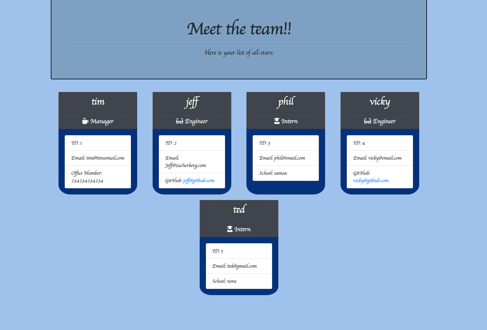

As a manager 
I want to generate a webpage that displays my team's basic info 
so that I have quick access to emails and GitHub profiles 

he dependencies are, jest for running the provided tests,  
and inquirer for collecting input from the user. 

The file Structure is: 

lib/ // classes and helper code 
output/ // rendered output 
templates/ // HTML template(s) 
test/ // jest tests 
Employee.test.js 
Engineer.test.js 
Intern.test.js 
Manager.test.js 
app.js // Runs the application 

User input 
The project must prompt the user to build an engineering team. An engineering 
team consists of a manager, and any number of engineers and interns. 

Roster output 
The project must generate a team.html page in the output directory, that displays a nicely formatted team  roster. Each team member should display the following in no particular order: 

Name 

Role 

ID 

Role-specific property (School, link to GitHub profile, or office number) 

